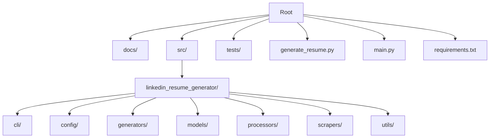

<link rel="stylesheet" href="https://diegobarrosa.github.io/diegobarrosaraya-assets/shared-theme.css">
<link rel="stylesheet" href="https://diegobarrosa.github.io/diegobarrosaraya-assets/shared-footer.css">
<script src="https://diegobarrosa.github.io/diegobarrosaraya-assets/shared-theme.js"></script>

# AI Context

## Project Summary

**linkedin-resume-generator** is a Python-based tool designed to generate professional resumes from LinkedIn profiles. Its goals are to automate resume creation, ensure compliance and privacy, and provide customizable output formats.

### Key Features
- LinkedIn profile scraping
- Resume generation in multiple formats
- Privacy and compliance auditing
- CLI interface
- Extensible architecture

## File & Directory Structure



## Coding Standards & Practices
- Follows PEP8 for Python code
- Uses descriptive naming conventions (snake_case for functions/variables, PascalCase for classes)
- Modular design with clear separation of concerns
- All documentation in `/docs`, overview in `README.md`

## Dependencies
- Python (see `requirements.txt`)
- Key packages:
  - requests
  - beautifulsoup4
  - pydantic
  - click
  - pytest

## Setup & Installation

1. Clone the repository:
   ```bash
   git clone https://github.com/DiegoBarrosA/linkedin-resume-generator.git
   cd linkedin-resume-generator
   ```
2. Build and run in Podman container (see below for container setup)

### Running Tests in Podman (Rootless)

1. Ensure Podman and podman-compose are installed and configured for rootless use.
2. Build and start the test container:
  ```bash
  podman-compose up --build
  ```
3. Tests will run automatically using pytest in the container.
4. To re-run tests:
  ```bash
  podman-compose up
  ```
5. To stop and remove containers:
  ```bash
  podman-compose down
  ```
6. All test results are shown in the terminal output.

## Testing Framework & Guidelines
- Uses `pytest` for unit testing
- All tests run inside Podman containers (rootless)
- Test files in `tests/unit/`
- To run tests:
  - Start container with Podman Compose
  - Run `pytest` inside the container

## API & External Interfaces
- CLI interface via `main.py` and `run_cli.py`
- Scraper modules for LinkedIn
- Configuration via `pyproject.toml` and `setup.py`

## Common Workflows & Examples
- Generate resume: `python main.py --profile <LinkedIn URL>`
- Run CLI: `python run_cli.py`
- Run tests: see container instructions

## Glossary
- **PEP8**: Python style guide
- **Podman**: Container engine
- **CLI**: Command Line Interface
- **Jekyll**: Static site generator for GitHub Pages
- **pytest**: Python testing framework
- **scraper**: Module for extracting data from web pages
